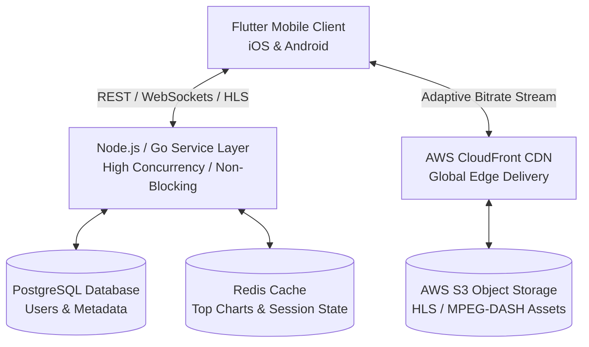

# Technical Architecture & Engineering Breakdown: LCMAudios

This document outlines the technical architecture, system design, feature roadmap, and engineering considerations for **LCMAudios** based on the product strategy requirements ([productKnowledge.md](file:///c:/xampp/htdocs/LCMAudios/productKnowledge.md)).

---

## 1. System Vision & Domain Architecture

* **Product Concept**: A high-concurrency "Faith in Motion" audio ecosystem combining music, sermons, and faith podcasts into a seamless playback experience.
* **Intent-Based Taxonomy**: Search and recommendation algorithms index media by **spiritual intent** (e.g., *Morning Devotion*, *Deep Worship*, *Warfare Prayers*, *Study Focus*) in addition to traditional metadata (artist, title, sub-genre like *Afrogospel* or *Traditional Hymns*).
* **Hybrid Media Streamer**: Single player engine designed for dynamic context switching between structured music tracks, long-form sermons, and spoken-word podcasts without audio clipping or interface jitter.

---

## 2. High-Level Technical Architecture

### Component Stack & Rationale

| Component | Technology | Technical Rationale |
| :--- | :--- | :--- |
| **Frontend Client** | **Flutter** | Single cross-platform codebase for iOS and Android, maximizing market reach while leveraging native platform audio services. |
| **Backend Services** | **Node.js / Go** | Non-blocking, event-driven I/O engine designed to manage thousands of simultaneous streaming sessions and lightweight API requests. |
| **Streaming Engine** | **HLS (Apple) & MPEG-DASH** | Adaptive Bitrate Streaming (ABS) to continuously scale quality (bitrate/resolution) dynamically based on network conditions (4G $\rightarrow$ 3G). |
| **Database Layer** | **PostgreSQL + Redis** | Relational persistence for structured schema (users, playlists, rights) with Redis in-memory caching for trending lists and user state. |
| **Content Delivery** | **AWS S3 + CloudFront** | S3 object storage fronted by edge-cached CDN nodes globally to minimize time-to-first-byte (TTFB) and streaming latency. |

---

## 3. Engineering Feature Roadmap

### Phase 1: Core Engine & Retention (MVP)
1. **Adaptive Audio Service**: Background playback engine with system lock-screen, OS notification center controls, and audio focus handlers.
2. **Offline Storage & DRM Engine**: Local encrypted media storage for offline listening with stream metering telemetry sent back upon device reconnection.
3. **Metadata & Search Engine**: Multi-faceted indexing supporting sub-genre and intent tagging.
4. **Auth & Identity Service**: OAuth2 / JWT-based authentication for user profiles, library persistence, and sync.

### Phase 2: Intelligence & Growth (V2)
1. **Custom AI Recommendation Engine**: Audio signal processing / ML embedding model that classifies audio dynamics (e.g., distinguishing high-tempo praise vs. low-frequency meditative worship).
2. **Timestamped Media Annotations**: Synchronized lyric/transcript rendering with interactive snippet highlighting and note taking tied to precise audio timestamps.
3. **Social Deep Linking**: Deep-link generation for timestamped quotes and integration with social platforms (Instagram / TikTok).

---

## 4. Engineering Bottlenecks & Critical Systems

1. **Metadata Ingestion Pipeline**: Independent creator uploads will feature messy or inconsistent ID3/EXIF metadata. A strict validation and normalization pipeline/admin service is required prior to production database publishing.
2. **Rights & Direct Monetization Accounting**: System requires stream verification logging, transparent royalty ledgering, and micro-transaction / direct tip processing to support independent creators.
